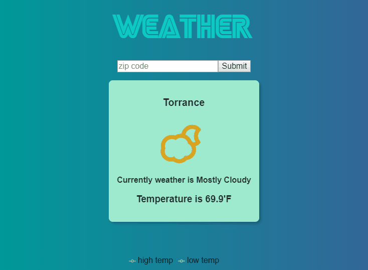

# Weather App with React
> It's a simple weather app built with React



## Getting Started

### Prerequisites

If you don't have Node.js setup on your computer, please click below link and download it first.

* [Node.js](https://nodejs.org/en/) - The official Node.js website to download

### Installing

If you already have Node.js, then follow below step.

On your terminal:

```
cd /c/<folder_path>
npm i
npm start

```

So it will automatically run in your local server.

## Built With

* [React.js](https://reactjs.org/) - The official React.js website
* [recharts](https://www.npmjs.com/package/recharts) - It's a chart library built with React and D3.

## Meta

James Jongho Kim 
- [Github](https://github.com/april9288) - This is my Github page
- [Linkedin](https://www.linkedin.com/in/jongho-kim-b05618170/) - This is my Linkedin page
- april9288@gmail.com

